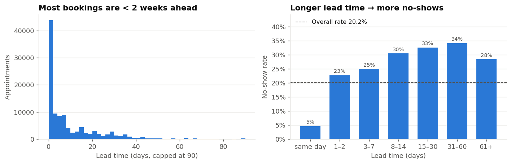
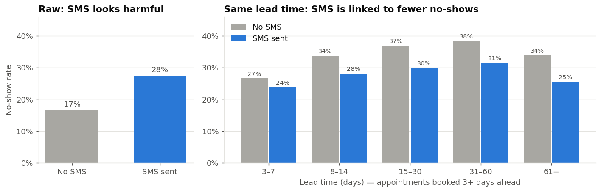

# MED-01 | Hospital Appointment No-Show Prediction

A machine learning model that predicts each outpatient appointment's **no-show risk** before it happens, so clinic staff can focus reminders, confirmations and follow-up calls on the appointments most likely to be missed.

The model only **informs** staff. It never cancels or rebooks appointments automatically.

| | |
|---|---|
| **Student** | Furkat Toshmatov |
| **Project track** | _To confirm_ |
| **Domain** | MedTech |
| **ML task** | Supervised binary classification |
| **Repository** | https://github.com/monfurkat-glitch/HealthProject |

> 🚧 Work in progress. Progress against the capstone criteria is tracked in [docs/ROADMAP.md](docs/ROADMAP.md) and [PROJECT_STATUS.md](PROJECT_STATUS.md).

## Problem statement

Unannounced no-shows waste clinic capacity and lengthen waiting times for other patients. Without a risk estimate, staff spread reminder efforts evenly across all appointments instead of targeting the ones most likely to be missed. See the full [project brief](docs/project_brief.md).

## ML task

| | |
|---|---|
| **Input** | One scheduled appointment: patient age, gender, neighbourhood, welfare status, health conditions, booking date, appointment date, and reminder status |
| **Target** | `No-show` (`Yes` = the patient did not attend) |
| **Output** | Probability of a no-show, plus a Low / Medium / High risk band |
| **Prediction moment** | Before the appointment, using only information known at that time |

## Success criteria

Measured on the held-out test period (the latest appointments, never used for training or tuning):

1. The final model beats both baselines (always "shows up" and logistic regression) on ROC-AUC and PR-AUC.
2. Among the 20% of appointments ranked riskiest, the model catches a larger share of real no-shows than the logistic regression baseline.
3. No leakage: every feature is computable at prediction time, verified by an automated test.
4. The Colab demo runs end to end in a fresh runtime from this repository alone.

## Dataset

[Medical Appointment No Shows](https://www.kaggle.com/datasets/joniarroba/noshowappointments) (Kaggle): 110,527 appointments from public health clinics in Vitória, Brazil (April–June 2016). The CSV is included in [`Data/`](Data/) under its CC BY-NC-SA 4.0 license; see [Data/README.md](Data/README.md) for the column dictionary, license, and known data issues.

### Exploratory data analysis

[](https://colab.research.google.com/github/monfurkat-glitch/HealthProject/blob/main/notebooks/01_eda.ipynb)

The full analysis, with charts, is in [`notebooks/01_eda.ipynb`](notebooks/01_eda.ipynb). It runs in Google Colab with no setup. Charts are saved in [`reports/figures/`](reports/figures/).




### Key data findings so far

- 62,299 patients, no missing values, no duplicate rows. 20.2% of appointments are no-shows.
- Invalid records: 1 row with `Age = -1`, and 5 appointments booked after the appointment date.
- `Handcap` is a 0–4 count, not a yes/no flag.
- Appointment dates only span about 6 weeks (2016-04-29 to 2016-06-08).
- Lead time (days between booking and appointment) is the strongest signal found so far: same-day bookings have a 4.6% no-show rate, against 28.5% for all other appointments.
- SMS reminders are confounded with lead time (they were only sent for bookings made 3 or more days ahead). Raw, SMS looks linked to *more* no-shows (27.6% vs 16.7%); within the same lead-time group it is linked to 3–8 points *fewer*.
- No-show rate peaks for ages 13–17 (27%) and is lowest for ages 66–80 (15%). Health flags, gender, and weekday each move it by less than 4 points.
- Leakage-safe patient history is only a modest signal: just 28% of appointments have any known prior appointment.

## Pipeline

```
raw appointment ─► clean() ─► add_history_features() ─► add_features() ─► encoder (fitted on train) ─► model ─► probability ─► risk band
```

All steps live in [`src/preprocess.py`](src/preprocess.py) and are shared by training and prediction.

| Step | What it does |
|---|---|
| `clean` | Renames columns, parses dates, encodes the target, and drops impossible rows (6 rows: 1 with negative age, 5 booked after the appointment) |
| `add_history_features` | `prior_appointments`, `prior_no_shows`, `prior_no_show_rate`: the patient's appointments dated **strictly before the booking day**, so only outcomes known at booking time are used |
| `add_features` | `lead_days`, `same_day`, `appointment_weekday`, `male`, `disability` (from the 0–4 `Handcap` count) |
| `build_preprocessor` | Standardises numeric features; one-hot encodes neighbourhood and weekday, grouping rare (< 50 training rows) and unseen neighbourhoods together |
| `time_split` | Chronological split by appointment date (below) |

### Data split

| Split | Appointment dates | Rows | Share | No-show rate |
|---|---|---|---|---|
| Train | 2016-04-29 → 2016-05-25 | 75,278 | 68.1% | 21.0% |
| Validation | 2016-05-30 → 2016-06-02 | 17,567 | 15.9% | 18.6% |
| Test | 2016-06-03 → 2016-06-08 | 17,676 | 16.0% | 18.5% |

The split is by time, not random, because the model will always predict *future* appointments from *past* data. The train/validation boundary falls in a 4-day gap with no appointments. The later periods have a slightly lower no-show rate, which the evaluation must take into account.

### Design decisions

- **Prediction moment: at booking time.** Every feature is known when the appointment is booked.
- **`SMS_received` is excluded by default.** Reminders are sent *after* booking, and deciding who gets one is exactly what the model is for, so SMS status is not known at prediction time. The EDA also shows it is confounded with lead time. It can be switched on (`include_sms=True`) for a comparison experiment.
- **Leakage is tested automatically.** [`tests/test_preprocess.py`](tests/test_preprocess.py) checks the history features against a brute-force recomputation on real data, and checks that changing future outcomes never changes a feature.

## Approach

- **Baselines:** majority class ("always shows up") and logistic regression.
- **Models to compare:** Random Forest and gradient boosting (scikit-learn `HistGradientBoostingClassifier`).
- **Metrics:** ROC-AUC, PR-AUC, and precision/recall on the no-show class (the classes are imbalanced, about 80/20).

## Repository structure

```
HealthProject/
├── Data/            dataset (CSV) and data dictionary
├── docs/            project brief and roadmap
├── notebooks/       EDA and Colab demo notebooks
├── src/             preprocessing, training, and prediction code
├── models/          saved model and preprocessing artifacts
├── experiments/     experiment log
├── reports/         evaluation results, figures, and error analysis
├── tests/           automated tests (pytest)
├── requirements.txt pinned dependencies
└── PROJECT_STATUS.md
```

## Installation

Requires Python 3.10 or newer.

```bash
git clone https://github.com/monfurkat-glitch/HealthProject.git
cd HealthProject
pip install -r requirements.txt
```

## Running the pipeline and tests

```bash
python -m src.preprocess     # builds the dataset and prints the split summary
python -m pytest             # runs the automated tests
```

## Training, demo, and inference

_Coming in later milestones (see [ROADMAP](docs/ROADMAP.md))._

## Results

_No results yet. Every number reported here will come from runs recorded in this repository._

## Limitations and Responsible AI

_To be completed; initial concerns:_
- The data comes from one Brazilian city's public health system in 2016 and may not generalise to other clinics or populations.
- Patient IDs are de-identified, but combinations of age, neighbourhood, and health conditions could still act as quasi-identifiers.
- A high risk score must never be used to deny, delay, or deprioritise care.

## License and acknowledgements

- **Dataset:** *Medical Appointment No Shows* by Joni Hoppen and Aquarela Analytics, [CC BY-NC-SA 4.0](https://creativecommons.org/licenses/by-nc-sa/4.0/). Redistributed unmodified for non-commercial educational use.
- **AI assistance:** Parts of this project's code and documentation were drafted with the help of Claude (Anthropic), an AI coding assistant, as allowed by the course rules. All design decisions were reviewed, and the student is responsible for and can explain every component.
