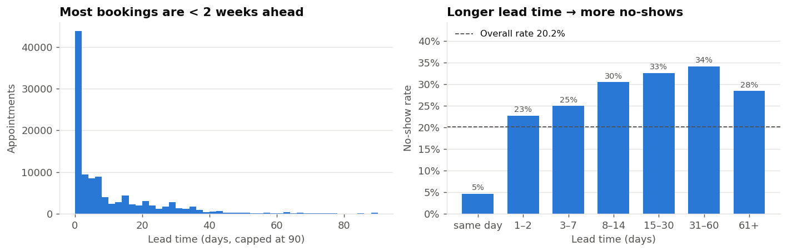
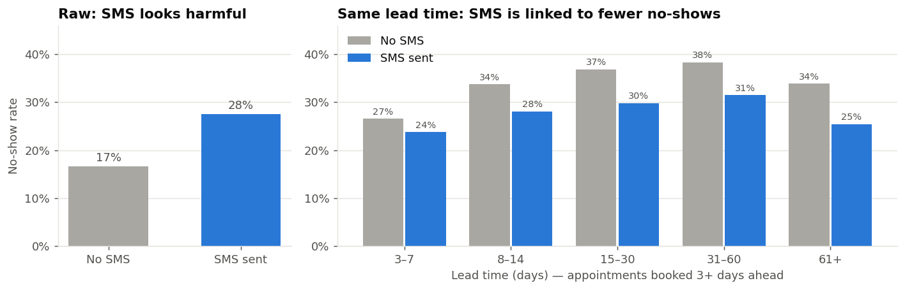
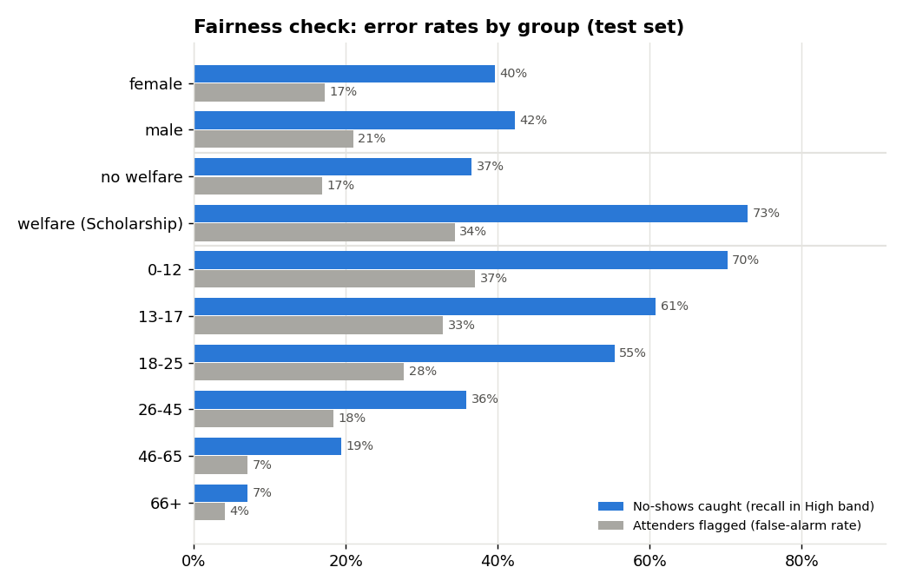

# MED-01 | Hospital Appointment No-Show Prediction

A machine learning model that predicts each outpatient appointment's **no-show risk** at booking time, so clinic staff can focus reminders, confirmations and follow-up calls on the appointments most likely to be missed.

The model only **informs** staff. It never cancels, rebooks, or refuses an appointment.

| | |
|---|---|
| **Student** | Furkat Toshmatov |
| **Project track** | Track 1: Individual Project (own proposal, see the [Project Brief](docs/project_brief.md)) |
| **Domain** | MedTech |
| **ML task** | Supervised binary classification (tabular data) |
| **Final model** | Logistic regression, test ROC-AUC **0.723** |
| **Repository** | https://github.com/monfurkat-glitch/HealthProject |

## Quick start

| | |
|---|---|
| **Whole project in one notebook** | [](https://colab.research.google.com/github/monfurkat-glitch/HealthProject/blob/main/notebooks/00_full_project.ipynb) → Runtime → Run all (5–10 min: data → experiments → test → fairness → predictions) |
| **Run the demo** (no setup) | [](https://colab.research.google.com/github/monfurkat-glitch/HealthProject/blob/main/notebooks/02_demo.ipynb) → Runtime → Run all |
| **Explore the data** | [](https://colab.research.google.com/github/monfurkat-glitch/HealthProject/blob/main/notebooks/01_eda.ipynb) |
| **Run locally** | `pip install -r requirements.txt` then `python -m src.predict examples/appointment.json` |

**Contents:** [Problem](#problem-statement) · [ML task](#ml-task) · [Data](#dataset) · [Pipeline](#pipeline) · [Models](#models-and-experiments) · [Final model](#final-model) · [Results](#results-test-set-used-once) · [Error analysis](#error-analysis-and-fairness) · [Demo](#demo-google-colab) · [Prediction](#prediction-inference) · [Setup and training](#installation) · [Reproducibility](#reproducibility) · [Structure](#repository-structure) · [Limitations](#known-limitations) · [Responsible AI](#responsible-ai) · [License](#license-and-acknowledgements)

## Problem statement

Unannounced no-shows waste clinic capacity and lengthen waiting times for other patients. Without a risk estimate, staff spread reminder efforts evenly across all appointments instead of targeting the ones most likely to be missed. See the full [project brief](docs/project_brief.md).

## ML task

| | |
|---|---|
| **Input** | One scheduled appointment: patient age, gender, neighbourhood, welfare status, health conditions, booking date, appointment date, and the patient's past attendance known at booking time |
| **Target** | `No-show` (`Yes` = the patient did not attend) |
| **Output** | Probability of a no-show, a Low / Medium / High risk band, and the main factors |
| **Prediction moment** | At booking time, using only information known then (SMS reminder status is therefore excluded) |

## Success criteria

Set before modelling; measured on the held-out test period. Details in [reports/test_results.md](reports/test_results.md#5-success-criteria-from-the-readme).

| # | Criterion | Outcome |
|---|---|---|
| 1 | The final model beats both baselines (always "shows up" and logistic regression) on ROC-AUC and PR-AUC | **Partly met.** It beats the majority-class and lead-time-rule baselines; no model reliably beat logistic regression on validation, so logistic regression became the final model |
| 2 | Among the 20% riskiest appointments, the model catches more no-shows than the logistic regression baseline | **Not met**, for the same reason (recall@top20: 0.362 vs 0.305 for the lead-time rule) |
| 3 | No leakage: every feature is computable at prediction time, verified by an automated test | **Met** |
| 4 | The Colab demo runs end to end in a fresh runtime from this repository alone | **Met** |

## Dataset

[Medical Appointment No Shows](https://www.kaggle.com/datasets/joniarroba/noshowappointments) (Kaggle): **110,527 appointments** of 62,299 patients at public health clinics in Vitória, Brazil (appointments from 2016-04-29 to 2016-06-08). 14 columns: patient ID, gender, age, neighbourhood, welfare status, four health flags, SMS reminder, booking and appointment dates, and the `No-show` target. The CSV is included in [`Data/`](Data/) under its CC BY-NC-SA 4.0 license; [Data/README.md](Data/README.md) has the column dictionary and known data issues.

### Exploratory data analysis

Full analysis with charts: [`notebooks/01_eda.ipynb`](notebooks/01_eda.ipynb) (runs in Colab). Charts are saved in [`reports/figures/`](reports/figures/).




**Key data findings**

- No missing values and no duplicate rows. **20.2%** of appointments are no-shows, an imbalanced target.
- Invalid records: 1 row with `Age = -1`, and 5 appointments booked after the appointment date. `Handcap` is a 0–4 count, not a yes/no flag.
- Appointment dates only span about 6 weeks.
- **Lead time is the strongest signal:** same-day bookings have a 4.6% no-show rate, against 28.5% for all other appointments.
- **SMS reminders are confounded with lead time** (they were only sent for bookings made 3 or more days ahead). Raw, SMS looks linked to *more* no-shows (27.6% vs 16.7%); within the same lead-time group it is linked to 3–8 points *fewer*.
- No-show rate peaks for ages 13–17 (27%) and is lowest for ages 66–80 (15%). Health flags, gender, and weekday each move it by less than 4 points.
- Leakage-safe patient history is a modest signal: only 28% of appointments have any known prior appointment.

## Pipeline

```
raw appointment ─► validate ─► clean ─► patient history ─► features ─► encoder ─► logistic regression ─► probability ─► risk band + factors
                  (predict.py)  └──────────── preprocess.py ────────────┘  (fitted on training data only)
```

All data steps live in [`src/preprocess.py`](src/preprocess.py) and are shared by training and prediction, so a new appointment is processed exactly like the training data.

| Step | What it does |
|---|---|
| `clean` | Renames columns, parses dates, encodes the target, and drops impossible rows (6 rows: 1 with negative age, 5 booked after the appointment) |
| `add_history_features` | `prior_appointments`, `prior_no_shows`, `prior_no_show_rate`: the patient's appointments dated **strictly before the booking day**, so only outcomes known at booking time are used |
| `add_features` | `lead_days`, `same_day`, `appointment_weekday`, `male`, `disability` (from the 0–4 `Handcap` count) |
| `build_preprocessor` | Standardises numeric features; one-hot encodes neighbourhood and weekday, grouping rare (< 50 training rows) and unseen neighbourhoods together |
| `time_split` | Chronological split by appointment date (below) |

### Data split

| Split | Appointment dates | Rows | Share | No-show rate |
|---|---|---|---|---|
| Train | 2016-04-29 → 2016-05-25 | 75,278 | 68.1% | 21.0% |
| Validation | 2016-05-30 → 2016-06-02 | 17,567 | 15.9% | 18.6% |
| Test | 2016-06-03 → 2016-06-08 | 17,676 | 16.0% | 18.5% |

The split is by time, not random, because the model will always predict *future* appointments from *past* data. The train/validation boundary falls in a 4-day gap with no appointments.

### Design decisions

- **Prediction at booking time.** Every feature is known when the appointment is booked.
- **`SMS_received` is excluded.** Reminders are sent *after* booking, and deciding who gets one is exactly what the model is for. The EDA also shows SMS is confounded with lead time, and including it improved validation ROC-AUC by only 0.001.
- **Leakage is tested automatically.** [`tests/test_preprocess.py`](tests/test_preprocess.py) checks the history features against a brute-force recomputation on real data, and checks that changing future outcomes never changes a feature. A deliberately planted leak makes these tests fail.

## Models and experiments

- **Baselines:** majority class, a lead-time rule (no ML), and logistic regression.
- **Models compared:** logistic regression (5 regularisation strengths), random forest (4 settings), and gradient boosting (scikit-learn `HistGradientBoostingClassifier`, 9 settings).
- **Metrics** ([`src/evaluate.py`](src/evaluate.py)): ROC-AUC, PR-AUC, precision and recall among the 20% riskiest appointments (matching limited staff capacity), and the Brier score for probability quality. Accuracy is not used: always predicting "shows up" would already be 81% accurate.
- **Experiment tracking:** all **23 validation runs** (plus the 4 one-time test runs) are logged with their git commit in [`experiments/runs.csv`](experiments/runs.csv); every run and its analysis are in [`experiments/README.md`](experiments/README.md).

| Model (best settings, validation set) | ROC-AUC | PR-AUC | recall@top20 |
|---|---|---|---|
| Majority class | 0.500 | 0.186 | 0.206 |
| Lead-time rule (no ML) | 0.693 | 0.284 | 0.328 |
| Logistic regression | 0.726 | 0.332 | 0.365 |
| Random forest (min 20 samples per leaf) | 0.726 | 0.323 | 0.363 |
| Gradient boosting (learning rate 0.03, 15 leaves, min 200 samples per leaf) | 0.729 | 0.331 | 0.368 |

- A **paired bootstrap** (1,000 resamples) shows **no model is reliably better than logistic regression** on validation: every 95% interval for the difference includes zero.
- **Overfitting is visible and controlled:** fully grown random-forest trees scored 0.999 on training data but 0.700 on validation; limiting leaf size fixed it.
- **Class weights** did not improve ranking and made the probabilities worse, so the imbalance is handled by choosing the risk-band thresholds instead.

## Final model

**Logistic regression** (`C = 1.0`, 14 features), refitted on train + validation and saved to [`models/final_model.joblib`](models/final_model.joblib) together with its risk-band cut-offs.

**Why:** it matched the best tree models within noise on validation, it is simpler, it does not overfit (train 0.728 vs validation 0.726), and each feature's effect can be explained to staff. The choice was made **on validation evidence only** and committed **before** the test set was used ([docs/final_model.md](docs/final_model.md)).

## Results (test set, used once)

Appointments 2016-06-03 to 2016-06-08 (17,676 rows, 18.5% no-shows). Full report: [reports/test_results.md](reports/test_results.md).

| Model | ROC-AUC | PR-AUC | recall@top20 |
|---|---|---|---|
| Majority class | 0.500 | 0.185 | 0.182 |
| Lead-time rule (no ML) | 0.692 | 0.278 | 0.305 |
| **Logistic regression (final)** | **0.723** (95% CI 0.715–0.732) | **0.328** | **0.362** |
| Gradient boosting (comparison) | 0.737 | 0.342 | 0.385 |

| Risk band | Share of appointments | No-show rate | Share of all no-shows |
|---|---|---|---|
| Low | 49.7% | 8.1% | 21.7% |
| Medium | 27.8% | 25.1% | 37.8% |
| High | 22.6% | 33.2% | 40.5% |

- The test score matches the validation score (0.726), so the model generalises as expected and clearly beats both baselines.
- Following up only the **High** band (23% of appointments) reaches **41% of all no-shows**. A High appointment is 4 times as likely to be missed as a Low one.
- **Gradient boosting was reliably better on the test set** (+0.013 ROC-AUC, 95% CI +0.009 to +0.018), unlike on validation. The pre-registered choice is kept so the test score stays an honest estimate; gradient boosting is recommended for a future version.
- Probabilities are slightly too high (21.2% predicted vs 18.5% observed), probably because the test period had fewer no-shows. Treat them as relative risk.

## Error analysis and fairness

Full report: [reports/error_analysis.md](reports/error_analysis.md).



- **Main limitation:** within a single lead-time group, the model ranks only a little better than chance (ROC-AUC 0.57–0.62). Most of its power comes from separating short from long lead times.
- **Errors:** caught no-shows and false alarms have almost identical profiles (young, booked weeks ahead), so the features cannot separate them. Missed no-shows look like typical attenders (older, short lead time). In the High band, about 2 of every 3 flagged appointments would have been attended.
- **New patients** without history are ranked as well as everyone else (ROC-AUC 0.717).
- **Fairness:** no material gender gap. **Welfare patients are flagged twice as often** (42% vs 20%) with twice the false-alarm rate. **Children are over-flagged and elderly no-shows are rarely caught** (7% recall for 66+), partly because the model treats age as a straight line.

## Demo (Google Colab)

[](https://colab.research.google.com/github/monfurkat-glitch/HealthProject/blob/main/notebooks/02_demo.ipynb)

Open [`notebooks/02_demo.ipynb`](notebooks/02_demo.ipynb) in Colab and choose **Runtime → Run all** (about 1–2 minutes; no uploads or setup needed). The notebook:

1. clones this repository and installs the pinned scikit-learn version;
2. loads the saved model and shows its settings and risk-band cut-offs;
3. scores one appointment from an editable form, with its risk band and main factors;
4. ranks a day's appointments by risk, as staff would see them;
5. shows invalid inputs being rejected and unusual inputs being scored with warnings;
6. looks up a real patient's history, counting only visits before the booking day;
7. **retrains the model from the raw CSV** and confirms it gives the same predictions as the saved model;
8. **re-scores the test set** and confirms the numbers in `reports/test_results.json`;
9. runs the automated tests.

## Prediction (inference)

[`src/predict.py`](src/predict.py) loads the saved model and scores new appointments. Every input is validated first.

```bash
python -m src.predict examples/appointment.json              # one appointment
python -m src.predict examples/appointments.json             # a list of appointments
python -m src.predict examples/appointments.json --history   # also look up each patient's past visits
python -m src.predict examples/invalid_appointment.json      # shows the validation errors
```

From Python:

```python
from src.predict import NoShowPredictor
predictor = NoShowPredictor()
predictor.predict({"age": 25, "gender": "F", "neighbourhood": "CENTRO",
                   "scheduled_day": "2016-06-01", "appointment_day": "2016-06-20"})
```

### Example input and output

Input ([`examples/appointment.json`](examples/appointment.json)):

```json
{
  "patient_id": "new-patient-001",
  "age": 19,
  "gender": "F",
  "neighbourhood": "JARDIM CAMBURI",
  "scholarship": 1,
  "hypertension": 0,
  "diabetes": 0,
  "alcoholism": 0,
  "handicap": 0,
  "scheduled_day": "2016-06-01T09:30:00",
  "appointment_day": "2016-06-29"
}
```

Output:

```json
{
  "no_show_probability": 0.3509,
  "risk_band": "High",
  "main_factors": [
    "not booked for the same day raises risk",
    "welfare (Scholarship) raises risk",
    "age 19 raises risk"
  ],
  "lead_days": 28,
  "prior_appointments": 0,
  "prior_no_shows": 0,
  "warnings": []
}
```

- `no_show_probability`: the model's estimated chance of a no-show; treat it as relative risk.
- `risk_band`: **Low** < 0.233 ≤ **Medium** < 0.323 ≤ **High**. The cut-offs are the 50th and 80th percentiles of the training predictions.
- `main_factors`: the inputs that move this appointment's risk most, compared with an average appointment.

### Input rules

| Field | Required | Accepted values |
|---|---|---|
| `age` | yes | whole number 0–115 (over 100: warning) |
| `gender` | yes | `F`/`M` (or `female`/`male`) |
| `scheduled_day`, `appointment_day` | yes | dates such as `2016-06-01`; the appointment cannot be before the booking. More than 179 days ahead or on a Sunday: warning |
| `neighbourhood` | no | name from the dataset; unknown or missing → treated as a rare neighbourhood, with a warning |
| `scholarship`, `hypertension`, `diabetes`, `alcoholism` | no | `0`/`1`, `yes`/`no`, `true`/`false`; missing → 0, with a warning |
| `handicap` | no | 0–4; missing → 0, with a warning |
| `prior_appointments`, `prior_no_shows` | no (both or neither) | whole numbers ≥ 0; otherwise looked up with `--history`, or 0 for a new patient |
| `patient_id` | no | used with `--history` |

Invalid inputs are rejected with **every** problem listed, e.g. for [`examples/invalid_appointment.json`](examples/invalid_appointment.json):

```
Cannot score this input:
 - 'age' must be between 0 and 115, got -4
 - 'gender' must be F or M, got 'X'
 - 'appointment_day' (2016-06-01) is before 'scheduled_day' (2016-06-10): an appointment cannot be booked after it happens
 - 'diabetes' must be 0 or 1 (or yes/no), got 'maybe'
```

## Installation

Requires Python 3.10 or newer. Everything runs on a laptop CPU.

```bash
git clone https://github.com/monfurkat-glitch/HealthProject.git
cd HealthProject
pip install -r requirements.txt
```

## Training and evaluation

Run from the repository root. Each step takes seconds to about a minute.

```bash
python -m src.preprocess              # builds the dataset and prints the split summary
python -m src.train baselines         # trains baselines, scores them on validation, logs the runs
python -m src.train logreg_tuning     # likewise: random_forest, gradient_boosting
python -m src.train compare           # paired bootstrap: best of each model family vs logistic regression
python -m src.final                   # trains the final model, saves it, scores it once on the test set
python -m src.error_analysis          # error analysis and fairness checks of the final model
python -m pytest                      # 55 automated tests
```

## Reproducibility

Everything was re-run from a **fresh clone** in a **new, empty Python environment** that had only `requirements.txt` installed:

| Check | Result |
|---|---|
| `notebooks/01_eda.ipynb` and `notebooks/02_demo.ipynb` | ran without errors |
| `notebooks/00_full_project.ipynb`: re-runs all experiments, the final evaluation, and the error analysis | ran without errors; retrained model and result files identical to the committed ones |
| Google Colab: `notebooks/02_demo.ipynb`, Runtime → Run all, straight from GitHub | ran cleanly |
| `python -m pytest` | 55 passed |
| `python -m src.train baselines` + `python -m src.final` + `python -m src.error_analysis` | all 9 logged runs gave identical metrics; `reports/test_results.json` and `reports/error_analysis.json` unchanged byte for byte |
| Retrained model vs saved `models/final_model.joblib` | identical coefficients, cut-offs, and reference values (only the creation date and commit fields differ) |

Library versions are pinned in [`requirements.txt`](requirements.txt), and all random seeds are fixed.

## Repository structure

```
HealthProject/
├── Data/                 dataset (CSV), data dictionary, license
├── docs/                 project brief, final-model decision, Responsible AI / model card
├── examples/             example inputs for prediction
├── experiments/          experiment log (runs.csv), bootstrap comparison, analysis
├── models/               saved final model with its risk-band cut-offs
├── notebooks/            00_full_project.ipynb (everything end to end), 01_eda.ipynb (data analysis), 02_demo.ipynb (Colab demo)
├── reports/              test results, error analysis, figures
├── showcase/             index.html: one-page public project showcase (static)
├── src/
│   ├── preprocess.py     cleaning, features, leakage-safe history, split, encoder
│   ├── train.py          baselines and experiments (logged)
│   ├── evaluate.py       metrics and bootstrap tests
│   ├── experiments.py    experiment log
│   ├── final.py          final training and one-time test evaluation
│   ├── error_analysis.py error analysis and fairness
│   └── predict.py        validation and prediction for new appointments
├── tests/                automated tests (pytest)
├── requirements.txt      pinned dependencies
└── PROJECT_STATUS.md     current status
```

## Known limitations

1. **Moderate accuracy:** ROC-AUC 0.72, and about 2 in 3 High-band appointments would have been attended anyway.
2. **Mostly driven by lead time:** among appointments booked equally far ahead, ranking is only a little better than chance.
3. **Short, old, local data:** 6 weeks in 2016 from one Brazilian city's public clinics. There is no appointment type, time of day, distance, or seasonality. Do not use it elsewhere without re-validation.
4. **Linear age effect:** children are over-predicted, teenagers under-predicted; gradient boosting handles this better.
5. **Probabilities drift:** about 2.7 points too high on the test week; use them as a ranking.
6. **Group differences:** welfare patients and children get more false alarms; elderly no-shows are rarely caught.
7. **No causal claims:** the model predicts risk; it does not measure whether a reminder would help (SMS status is excluded).

## Responsible AI

Full model card: [docs/responsible_ai.md](docs/responsible_ai.md).

- **Intended use:** ranking upcoming appointments so **operations staff** can offer **supportive** follow-up (reminders, confirmation calls, rescheduling offers). A person always decides.
- **Prohibited uses:** cancelling, delaying, or refusing care; overbooking flagged patients' slots; penalising patients; clinical, insurance, or eligibility decisions.
- **Fairness:** the model uses sensitive attributes (welfare status, health conditions, age, neighbourhood) that raise the scores of poorer and sicker patients. This is acceptable only for supportive help. Error rates by welfare status and age group should be monitored.
- **Privacy:** the data is public and de-identified but contains quasi-identifiers; the saved model holds no patient records; real deployment would fall under health-data law (e.g. Brazil's LGPD), requiring access control, minimal data, and audit logs.
- **Safety:** input validation rejects impossible inputs and warns on inputs outside the training range; every prediction lists its main factors, which helps staff question it rather than blindly trust it.

## License and acknowledgements

- **Dataset:** *Medical Appointment No Shows* by Joni Hoppen and Aquarela Analytics, [CC BY-NC-SA 4.0](https://creativecommons.org/licenses/by-nc-sa/4.0/). Redistributed unmodified for non-commercial educational use.
- **Libraries:** pandas, NumPy, scikit-learn, matplotlib, joblib, pytest.
- **AI assistance:** Parts of this project's code and documentation were drafted with the help of Claude (Anthropic), an AI coding assistant, as allowed by the course rules. All design decisions were reviewed, and the student is responsible for and can explain every component.
