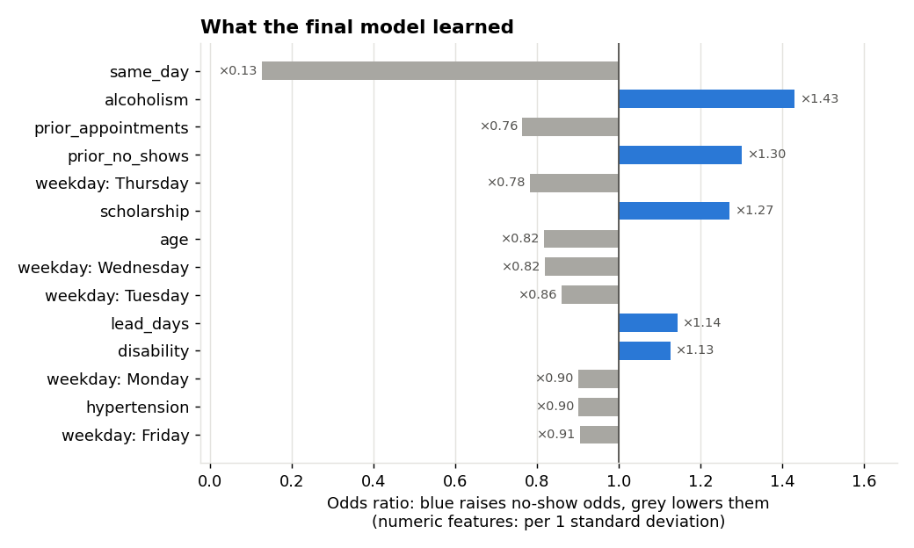
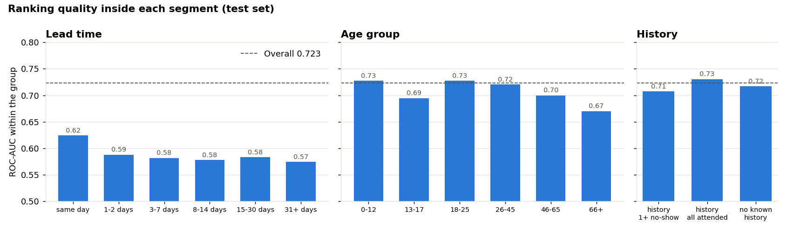

# Error analysis and fairness

Produced by `python -m src.error_analysis`: the saved final model (logistic regression) on the **test set** (17,676 appointments, 2016-06-03 to 06-08). This is analysis only; nothing was re-tuned after seeing it. Raw numbers: [error_analysis.json](error_analysis.json).

**"Flagged"** means the appointment is in the **High** risk band, the group staff would follow up.

## 1. What the model learned

- **Same-day booking is by far the strongest signal:** it cuts the odds of a no-show to about one eighth (×0.13).
- **Past behaviour matters:** each extra past no-show raises the odds (×1.30 per standard deviation), while simply having more past appointments lowers them (×0.76). Regular attenders are low-risk.
- **Welfare status (×1.27), alcoholism (×1.43), and younger age (×0.82 per standard deviation older)** raise risk. Gender has essentially no effect (×1.01).
- Neighbourhood effects are moderate (odds ratios 0.62 to 1.53); lead time beyond "same day" adds only ×1.14 per standard deviation.

## 2. Types of mistakes

| | Actually a no-show | Actually attended |
|---|---|---|
| **Flagged (High)** | 1,324 caught | 2,666 false alarms |
| **Not flagged** | 1,944 missed | 11,742 correct |

Following up the High band reaches **40.5%** of no-shows; **33.2%** of flagged appointments are real no-shows. For every no-show caught, staff also contact about **two** patients who would have come anyway.

**Who are the errors?** (average profile of each outcome)

| Outcome | Mean age | Median lead time | Same-day | Welfare | Has history |
|---|---|---|---|---|---|
| Caught no-show | 22.6 | 20 days | 1.7% | 19.5% | 39% |
| False alarm | 22.5 | 18 days | 0.6% | 17.7% | 38% |
| Missed no-show | 42.1 | 7 days | 11.8% | 4.9% | 46% |
| Correctly not flagged | 41.5 | 1 day | 49.8% | 7.7% | 49% |

- **Caught no-shows and false alarms look almost identical.** Both are young patients booked weeks ahead. With the available features, the model cannot tell which of them will actually stay away: the information is not in the data.
- **Missed no-shows look like typical attenders:** older patients with short lead times. Nothing in the features marks them as risky, so any model built on these features would struggle with them.

## 3. Performance inside segments

- **Within a single lead-time group, ranking quality drops to 0.57–0.62 ROC-AUC.** Most of the model's power comes from separating short from long lead times; among appointments booked equally far ahead, it ranks only a little better than chance. This is the main limitation of the model.
- **New patients are handled well:** appointments with no known history score 0.717, close to the overall 0.723. The model does not depend on having a patient's history.
- **Older patients are ranked least well** (0.67 for 66+).
- Neighbourhoods with at least 300 test appointments range from 0.63 to 0.82 ROC-AUC. Every neighbourhood in the test set was also in the training data.

## 4. Fairness

Two error rates per group: **recall** (share of the group's no-shows that are flagged) and **false-alarm rate** (share of the group's attenders that are flagged). A fair tool would have similar rates across groups with similar real risk.

| Group | Appointments | Real no-show rate | Mean predicted | Flagged | Recall | False alarms |
|---|---|---|---|---|---|---|
| Female | 11,664 | 18.3% | 21.2% | 21.3% | 39.6% | 17.3% |
| Male | 6,012 | 18.8% | 21.2% | 25.0% | 42.3% | 21.0% |
| No welfare | 15,946 | 18.3% | 20.7% | 20.4% | 36.6% | 16.8% |
| **Welfare** | 1,730 | 20.5% | **25.2%** | **42.2%** | 72.9% | **34.3%** |
| Age 0–12 | 3,465 | 18.4% | **24.5%** | 43.2% | 70.2% | 37.0% |
| Age 13–17 | 979 | 25.5% | 24.3% | 39.9% | 60.8% | 32.8% |
| Age 46–65 | 4,845 | 15.3% | 19.0% | 8.9% | 19.4% | 7.0% |
| **Age 66+** | 2,201 | 14.1% | 16.8% | 4.5% | **7.1%** | 4.1% |

**Gender: no material disparity.** Both groups have almost the same real no-show rate and similar error rates; men are flagged slightly more often (25% vs 21%).

**Welfare (Scholarship) patients are flagged twice as often** (42% vs 20%), and their attenders get **twice the false-alarm rate** (34% vs 17%), even though their real no-show rate is only slightly higher on the test set (20.5% vs 18.3%). Checking the training data explains it: there the model was accurate for this group (24.3% predicted vs 24.4% observed), because welfare patients really did miss more appointments then. In the test week their no-show rate fell, so the model over-predicts for them. **Risk:** welfare patients, a low-income group, receive more unnecessary contact. That is acceptable only if the follow-up is supportive (a reminder call). It would be harmful if the score were used to overbook their slots or give them lower priority.

**Age drives large differences in who is flagged**, from 43% of children (0–12) to 4.5% of patients aged 66+. Part of this is real (older patients do miss fewer appointments), but part is a **model limitation**: logistic regression treats age as a straight line, while the real pattern peaks in the teenage years. Even on its own training data the model over-predicts children (23.4% predicted vs 20.9% observed) and under-predicts teenagers (22.9% vs 26.8%). As a result, **children's attenders get many false alarms, and elderly patients' no-shows are almost never flagged** (7% recall).

## 5. Conclusions

1. The model is useful but limited: it mostly separates short from long lead times, and cannot distinguish, among patients booked equally far ahead, who will actually miss.
2. It works for new patients with no history.
3. **Fairness concerns:** welfare patients and children are flagged much more often, with higher false-alarm rates; elderly no-shows are rarely caught. The tool must only be used for **supportive** follow-up, never to restrict access.
4. **Recommended improvements for a future version** (not applied here, because the test set has already been used):
   - model age non-linearly (age groups or splines), which would reduce the child/teen errors; gradient boosting does this automatically and was better on the test set;
   - recalibrate the probabilities on recent data, to track changes such as the drop in welfare-group no-shows;
   - monitor error rates by welfare status and age group after deployment.
