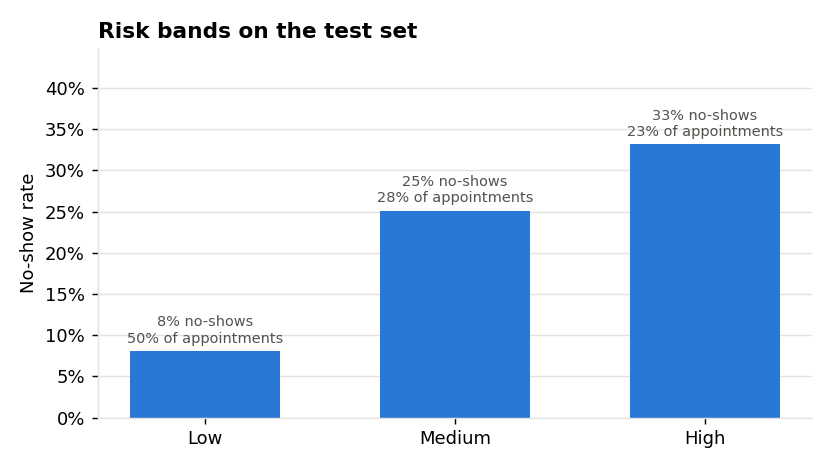
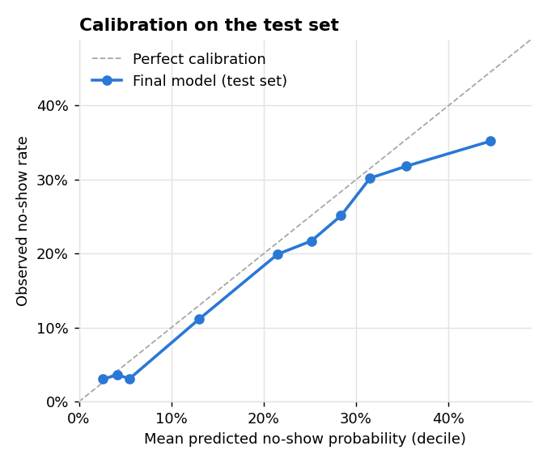

# Test set results

Produced by `python -m src.final` at commit `87bf5a4`, which also contains the pre-registered decision in [docs/final_model.md](../docs/final_model.md). Raw numbers are in [test_results.json](test_results.json) and the run log ([experiments/runs.csv](../experiments/runs.csv), experiment `final_test`).

- **Test set:** appointments 2016-06-03 to 2016-06-08; 17,676 rows; **18.5% no-shows**. Never used before this run.
- **Training data for every model:** train + validation (2016-04-29 to 2016-06-02; 92,845 rows; 20.5% no-shows).

## 1. All models on the test set

| Model | ROC-AUC | PR-AUC | precision@top20 | recall@top20 | Brier |
|---|---|---|---|---|---|
| Majority class (baseline) | 0.500 | 0.185 | 0.168 | 0.182 | 0.151 |
| Lead-time rule (baseline, no ML) | 0.692 | 0.278 | 0.282 | 0.305 | 0.140 |
| **Logistic regression (final model)** | **0.723** | **0.328** | **0.335** | **0.362** | **0.138** |
| Gradient boosting (comparison) | 0.737 | 0.342 | 0.356 | 0.385 | 0.136 |

### Final model with 95% bootstrap intervals

| Metric | Estimate | 95% interval |
|---|---|---|
| ROC-AUC | 0.723 | 0.715 – 0.732 |
| PR-AUC | 0.328 | 0.315 – 0.343 |
| precision@top20 | 0.335 | 0.320 – 0.351 |
| recall@top20 | 0.362 | 0.349 – 0.379 |
| Brier | 0.138 | 0.135 – 0.140 |

**The final model generalises as expected:** its test ROC-AUC (0.723) is almost identical to its validation ROC-AUC (0.726), so the choices made on validation did not overfit it. It clearly beats both baselines: +0.22 ROC-AUC over the majority class and +0.03 over the lead-time rule. Contacting its riskiest 20% of appointments reaches 36% of all no-shows, about **1.8× more than contacting 20% at random** (the random share is 20%).

## 2. Logistic regression vs gradient boosting

| Gradient boosting minus logistic regression | Mean difference | 95% interval | GB better in |
|---|---|---|---|
| ROC-AUC | +0.013 | +0.009 to +0.018 | 100% of resamples |
| recall@top20 | +0.023 | +0.010 to +0.036 | 100% of resamples |

**On the test set, gradient boosting is reliably better than logistic regression.** This differs from validation, where the gap (+0.003) was within noise. Possible reasons:

- the models were refitted on 23% more data (train + validation); boosting may benefit more from extra data than a linear model;
- the validation period was short (4 days), so its estimate of the gap was noisy.

**Decision: the final model stays logistic regression, as pre-registered.** Switching now would mean choosing a model *because* of its test score, and then the test score would no longer be an honest estimate of real-world performance. This result is reported as a finding instead: **gradient boosting is the recommended candidate for a future version**, to be confirmed on new, unseen data.

## 3. Risk bands

Cut-offs were fixed from the final model's probabilities on the training data (50th and 80th percentiles): **Low < 0.233 ≤ Medium < 0.323 ≤ High**.

| Band | Appointments | Share of appointments | No-show rate | Share of all no-shows |
|---|---|---|---|---|
| Low | 8,776 | 49.7% | **8.1%** | 21.7% |
| Medium | 4,910 | 27.8% | 25.1% | 37.8% |
| High | 3,990 | 22.6% | **33.2%** | 40.5% |

- The bands separate risk well: a **High** appointment is **4 times** as likely to be missed as a **Low** one (33.2% vs 8.1%).
- Following up only the High band (23% of appointments) reaches **41% of all no-shows**.
- The High band holds 22.6% of test appointments rather than the planned 20%, because the cut-offs were fixed on the training period, whose score distribution was slightly different.

## 4. Calibration

| Decile | Mean predicted | Observed |
|---|---|---|
| 1 | 2.6% | 3.1% |
| 3 | 5.5% | 3.1% |
| 5 | 21.5% | 19.9% |
| 8 | 31.5% | 30.2% |
| 10 | 44.5% | 35.2% |

The probabilities follow the observed rates closely, but are **slightly too high overall**: 21.2% predicted on average vs 18.5% observed. The largest gap is in the riskiest decile (44.5% vs 35.2%). The most likely cause is a **shift in the base rate**: the training period had 20.5% no-shows, the test period only 18.5%. **Rankings and bands are unaffected, but the raw probabilities should be read as relative risk, not exact chances.** Recalibrating on recent data is a recommended next step.

## 5. Success criteria (from the README)

| # | Criterion | Result |
|---|---|---|
| 1 | Final model beats both baselines (always "shows up" and logistic regression) on ROC-AUC and PR-AUC | **Partly met.** It beats the majority-class and lead-time-rule baselines. The "beat logistic regression" part cannot be met, because no model reliably beat logistic regression on validation, so it became the final model |
| 2 | Top-20% recall higher than the logistic regression baseline | **Not met**, for the same reason. Recall@top20 is 0.362 (0.305 for the lead-time rule, 0.182 for majority) |
| 3 | No leakage, verified by an automated test | **Met** (`tests/test_preprocess.py`) |
| 4 | The Colab demo runs end to end in a fresh runtime | Pending (Day 9) |
